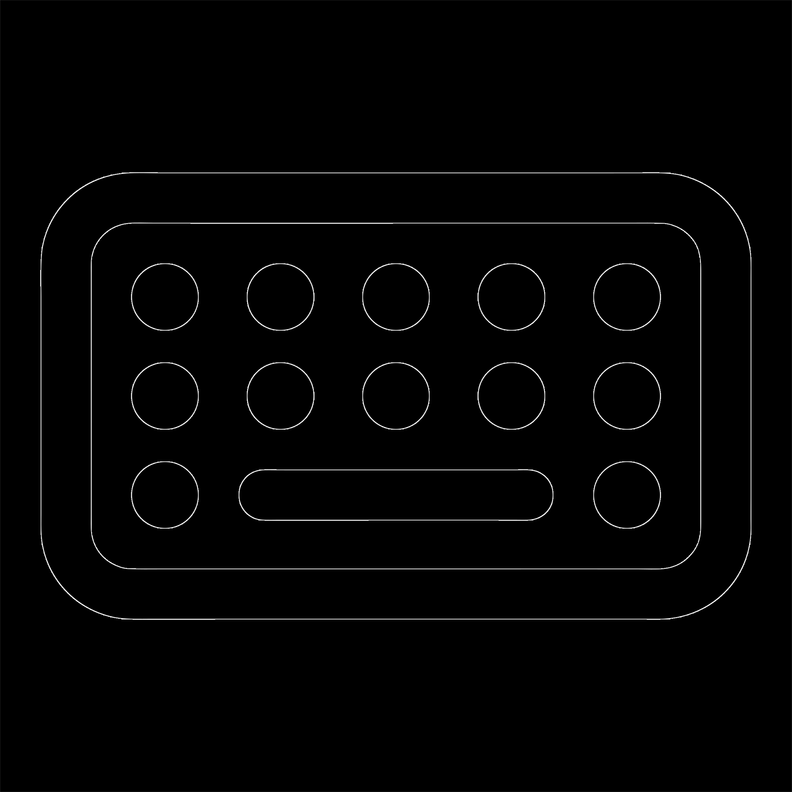

<div align="center">
  
  
  <h1>TEZTERU<span style="color: #646669">.KZ</span></h1>
  
  <p align="center">
    <strong>Қазақ тілінде жылдам жазуды дамытуға арналған заманауи веб-платформа.</strong><br />
    <em>A modern typing practice platform for the Kazakh language.</em>
  </p>

  <p align="center">
    <a href="https://tezteru.kz">
      
    </a>
    
    
  </p>

  <p align="center">
    
    
    
    
    
  </p>
</div>

---

## 🏗 Жоба туралы | About Project

**tezteru.kz** — бұл қазақ тілінде теру жылдамдығын арттыруға мүмкіндік беретін ашық кодты платформа. Monkeytype стиліндегі минималистік дизайн мен кең функционалдық мүмкіндіктерді ұсынады. Жоба толықтай **PWA** болып табылады және барлық құрылғыларда жылдам жұмыс істейді.

**tezteru.kz** is an open-source typing practice platform specifically for the Kazakh language. Inspired by Monkeytype, it offers a minimalist design with powerful features. The project is fully **PWA-enabled**, ensuring a smooth experience across all devices.

---

## ✨ Негізгі мүмкіндіктер | Key Features

*   **⚡️ Жоғары өнімділік (High Performance):** "Character Windowing" және `requestAnimationFrame` технологиялары арқылы өте жылдам теру тәжірибесі.
*   **📱 PWA Қолданысы:** Сайтты Android, iOS және Windows құрылғыларына жеке қолданба ретінде орнату мүмкіндігі.
*   **🔐 Google One Tap:** Тіркелудің ең оңай және жылдам жолы.
*   **🎮 Жарыс режимі (Multiplayer):** Нақты уақыт режимінде достарыңызбен жарысыңыз.
*   **🎨 Теңшелетін тақырыптар:** Көзді шаршатпайтын 10-нан астам түсті тақырыптар.
*   **📊 Профиль мен Статистика:** WPM, Accuracy және жетістіктеріңізді бақылаңыз.

---

## 📚 Толық документация | Documentation

Толығырақ ақпарат алу үшін мына құжаттарды қараңыз:

* 📖 **[Firebase Баптау нұсқаулығы](docs/FIREBASE_SETUP.md)** — Жобаны Firebase-пен біріктіру.
* 🏗 **[Жоба Архитектурасы](docs/ARCHITECTURE.md)** — Техникалық шешімдер мен өнімділік.
* 📱 **[PWA нұсқаулығы](docs/PWA_GUIDE.md)** — Орнату және оффлайн мүмкіндіктер.
* 🤝 **[Үлес қосу (Contributing)](CONTRIBUTING.md)** — Жобаға қалай көмектесу керек.

---

## 🚀 Іске қосу | Getting Started

### Талаптар (Prerequisites)
- [Node.js](https://nodejs.org/) (v18+)
- [npm](https://www.npmjs.com/)

### Орнату қадамдары
1.  **Репозиторийді клондау:**
    ```bash
    git clone https://github.com/perdeev/tezteru.kz.git
    cd tezteru.kz
    ```

2.  **Тәуелділіктерді орнату:**
    ```bash
    npm install
    ```

3.  **.env файлын баптау:**
    `.env.example` файлын көшіріп, Firebase кілттерін толтырыңыз.

4.  **Локалды іске қосу:**
    ```bash
    npm run dev
    ```

---

## 👤 Авторы | Author

**Азамат Пердеев** - (Azamat Perdeev)

- GitHub: [@perdeev](https://github.com/perdeev)
- Email: [perdeev.azamat@gmail.com](mailto:perdeev.azamat@gmail.com)
- Web: [tezteru.kz](https://tezteru.kz)

---

<div align="center">
  Қазақ тілін бірге дамытайық! ✨<br />
  <em>Let's develop the Kazakh language together!</em>
</div>
